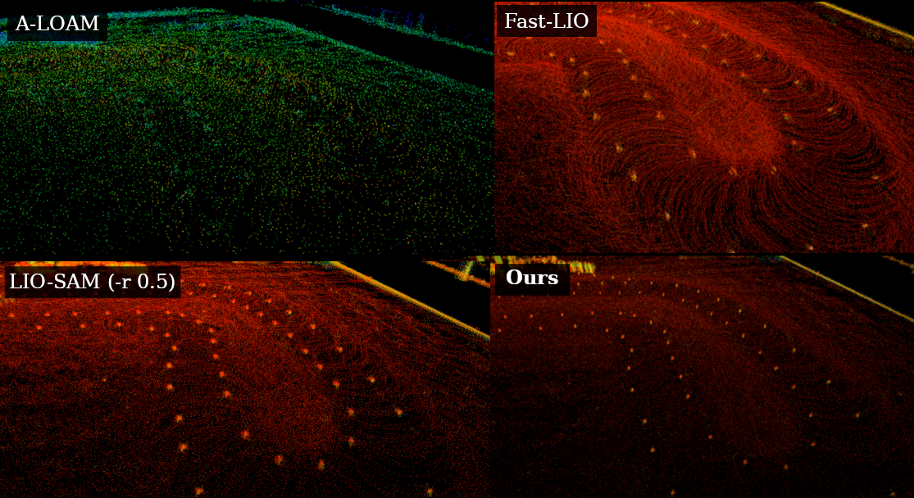
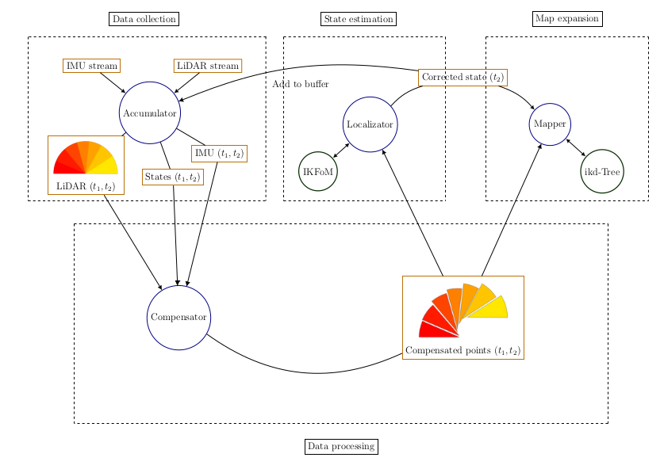
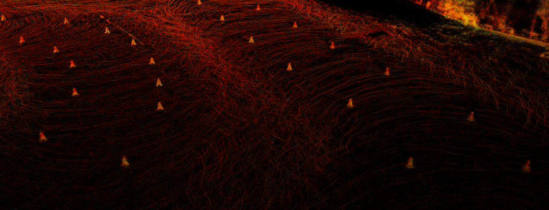

# LIMO-Velo
Contact me at ``andreu.huguet@estudiantat.upc.edu`` for questions or ideas.

## AVISO NAVEGANTES DE ARUS! INSTRUCCIONES PARA QUE FUNCIONE A LA PRIMERA
1- Os aseguráis de tener todas las librerías necesarias que se especifican en el apartado Dependencies. Un poco más abajo. 

2- Hacéis un workspace nuevo y en la carpeta de src clonais el repo. 
¡¡MUY IMPORTANTE CLONAR CON EL SIGUIENTE COMANDO!!

	git clone --recurse-submodules git@github.com:ARUSfs/LIMO-Velo.git

3- Al hacer catkin build a mi por lo menos me peta el ordenador por un supuesto fallo de eigen. La solución es, cuando vuelve en sí el ordenador cerráis la terminal donde se está haciendo el catkin build, ya que no va a terminar nunca (lo he probado), y lo volvéis a intentar en otra terminal. Esta ya no da error y compila el código perfectamente. 

4- Ya debería estar todo operativo, sobretodo yo he probado xaloc.launch que son con el coche de Barcelona y son los rosbags más completos y parecidos a los que vamos a tener. Los otros launch los probé con el dataset del KITT y funcionan, pero son de coches normales y no se como les podemos sacar provecho.

## A real-time LiDAR-Inertial SLAM for high velocities in spinning LiDARs.

   
  Visualization of the algorithm with <code>delta = 0.01</code> (100Hz)

Designed for easy modifying via modular and easy to understand code. Relying upon [HKU-Mars](https://github.com/hku-mars)'s [IKFoM](https://github.com/hku-mars/IKFoM) and [ikd-Tree](https://github.com/hku-mars/ikd-Tree) open-source libraries. Based also on their [FAST_LIO2](https://github.com/hku-mars/FAST_LIO).

### Tested and made for racing at Formula Student Driverless
Common working speeds are 20m/s in straights and 100deg/s in the turns.

   
  Tested on and made for Barcelona's own "<a href="https://www.youtube.com/watch?v=ly_ax8w-T7E&feature=emb_logo">Xaloc</a>".

### Centimeter-level accuracy is kept under racing speeds
Only algorithm that can deliver centimeter-level resolution on real-time. See the part of my thesis where I explain the algorithm and its results: [LIMOVelo + Results](https://github.com/Huguet57/LIMO-Velo/blob/main/config/docs/Thesis%20-%20LIMOVelo%20%2B%20Results.pdf).

   
  Comparison of cones under racing speeds running all algorithms in real-time, except for LIO-SAM (-r 0.5). It failed otherwise.

### Designed to be easily understood even by beginners
Developing an algorithm for a team requires the algorithm to be easy enough to understand being passed through generations.

   
  LIMO-Velo's pipeline. Here are seen the different modules (blue), data (orange) and libraries (dark green).

# LiDARs supported
- Velodyne
- Hesai
- Ouster
- Livox (check ``livox`` git branch)

# Dependencies
- [Ubuntu](https://ubuntu.com) (tested on 18.04, 20.04)
- [ROS](http://wiki.ros.org/ROS/Installation) (tested on Melodic, Noetic)
- [Eigen](http://eigen.tuxfamily.org/index.php?title=Main_Page)
- [PCL](http://www.pointclouds.org/downloads/linux.html) (tested on 1.8)

# Newest additions
## High Quality Maps
Sometimes a higher map quality is needed, now a new ``high_quality_publish`` parameter has been added to yield results like this below.

   
  Sometimes Xaloc needs more definition to see if a cluster of points is actually a cone.

# Sample datasets

   
  Xaloc's "fast" dataset. High velocity in the straights (~15m/s) and tight turns (~80deg/s).

Try ``xaloc.launch`` with Xaloc's own rosbags.
- :checkered_flag: Find a ``slow`` (818MB) and a ``fast`` (1.71GB) run in [this Dropbox folder](https://www.dropbox.com/sh/4116xoc7srps6a5/AAC3q1h50swG7fRMI3USNn2la?dl=0).

See Issue [#10](https://github.com/Huguet57/LIMO-Velo/issues/10) to see other sample datasets found in the web.
Don't hesitate to ask there for more data on specific scenarios/cases.

# Using LIMO-Velo

## 0. Cloning the repository
When cloning the repository, we also need to clone the [IKFoM](https://github.com/hku-mars/IKFoM) and [ikd-Tree](https://github.com/hku-mars/ikd-Tree) submodules. Hence we will use the ``--recurse-submodules`` tag.

``git clone --recurse-submodules https://github.com/Huguet57/LIMO-Velo.git``

## 1. Compiling the code
We either can do ``catkin_make`` or ``catkin build`` to compile the code. By default it will compile it optimized already

## 2. Running LIMO-Velo
To run LIMO-Velo, we can run the launch file ``roslaunch limovelo test.launch`` if we want a visualization or ``roslaunch limovelo run.launch`` if we want it without.

### 2.1 Debugging LIMO-Velo
An additional launch file ``roslaunch limovelo debug.launch`` is added that uses [Valgrind](https://valgrind.org/) as a analysing tool to check for leaks and offers detailed anaylsis of program crashes.

## 3. Changing parameters
To adapt LIMO-Velo to our own hardware infrastructure, a [YAML](https://yaml.org/) file ``config/params.yaml`` is available and we need to change it to our own topic names and sensor specs.

Relevant parameters are:
- ``real_time`` if you want to get real time experience.
- ``mapping_offline`` is on an pre-alpha stage and it does not work 100% as it should of.
- ``initialization`` which you can choose how you want the initialization of the pointcloud sizes (sizes =: deltas, in seconds).

# References
- [IKFoM](https://github.com/hku-mars/IKFoM): Iterated Kalman Filters on Manifolds
- [ikd-Tree](https://github.com/hku-mars/ikd-Tree): Incremental KD-Tree for Robotic Applications
- [FAST-LIO2](https://github.com/hku-mars/FAST_LIO): Fast and Direct LIO SLAM

